# Project 2, Milestone 1: Design Journey

[← Table of Contents](design-journey.md)

**Make the case for your decisions using concepts from class, as well as other design principles, theories, examples, and cases from outside of class (includes the design prerequisite for this course).**

You can use bullet points and lists, or full paragraphs, or a combo, whichever is appropriate. The writing should be solid draft quality.

## Catalog
> What will your catalog website be about? (1 sentence)

My catalog website will be about a campus events catalog where students can browse and discover upcoming student events, and admin (student campus event leaders) will be able to post and manager their events.

## Consumer Planning

### Consumer: _Cohesive_ Audience
> Briefly explain your site's **consumer** audience.
> Your audience should be specific, but not arbitrarily specific.

Cornell transfer students (sophomore/junior) or freshmen who are new to campus and feeling disconnected from the campus community and want to discover what student organizations and events exist to help them get involved and find their place on campus.

> Be specific and justify why this audience is a **cohesive** group. (1-2 sentences)

This ia cohesive audience because they share a common problems of not knwoing what events are available on campus, specifically because they are so unfamilar and new to campus. This will lead to feelings of disconnection and missing home, and they have similar goals in exploring diverse events to discover communities that match their availabity and confort level.

### Consumer: Audience Goals
> Document your **consumer** audience's goals.
> List each goal below. There is no specific number of goals required for this, but you need
> enough to do the job (Hint: It's at least 1, but probably no more than 3).

Goal 1: Discover what student organizations and events exist on campus

Goal 2: Find events that match their interests, schedule and budget a newcomer on campus.

Goal 3: Feel less isolated by connecting with campus communities through events

### Consumer: Persona
> Use the goals you identified to develop a persona of your site's **consumer** audience.
> Your persona must have a name and a face. The face can be a photo of a face or a drawing, etc.
> You may type out the persona below with bullet points or include an image of the persona.
> Just make sure it's easy to read the persona when previewing markdown.

Persona's Name: Emma
>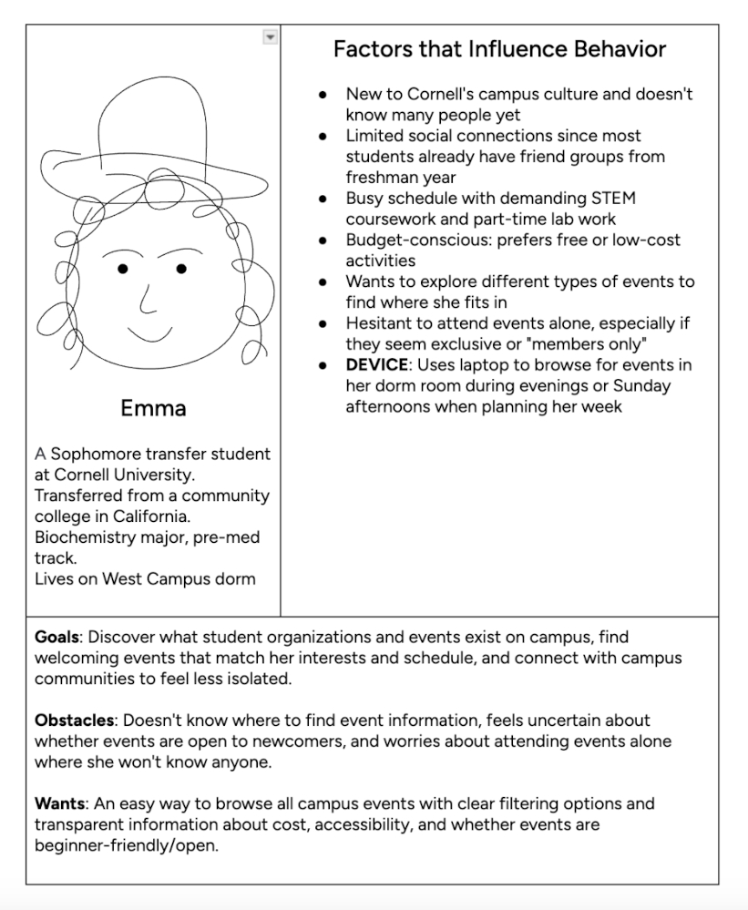

### Consumer: Narrow or Wide Screen
> How will your **consumer** user access this website? From a narrow or wide screen?

Wide screen because Emma will want to browse for events on her laptop in her dorm during the evenings when planning her week ahead, and thoroughly explore what's available and decides what fits her schedule, which is easier to do on a larger screen.

## Administrator Planning

### Administrator: _Cohesive_ Audience
> Briefly explain your site's **administrator** audience.
> Your audience should be specific, but not arbitrarily specific.

My site's administrator audience are student organization leaders and event coordinators at Cornell who are responisble for promoting their club's event and managing event information to attract attendees and keep the campus community informed.

> Be specific and justify why this audience is a **cohesive** group. (1-2 sentences)

This is a cohesive audience because they are specificaly students who hold leadership positions in campus organizations with event management responsibilities, distinguishing them from genereal student body who attend events. They all share the need to publicize their organization's event to reach potential attendees and maintain an accurate and up-to-date informations, and need authority to post/edit/remove events on behalf of their organization.

### Administrator: Audience Goals
> Document your **administrator** audience's goals.
> List each goal below. There is no specific number of goals required for this, but you need
> enough to do the job (Hint: It's at least 1, but probably no more than 3).

Goal 1: Post and promote their org's events to reach potential attendees

Goal 2: Keep event information accurate by editing detailed and removing cancelled events.

Goal 3: Organize events with appropriate tags to help student discover them through filtering

### Administrator: Persona
> Use the goals you identified to develop a persona of your site's **administrator** audience.
> Your persona must have a name and a face. The face can be a photo of a face or a drawing, etc.
> You may type out the persona below with bullet points or include an image of the persona.
> Just make sure it's easy to read the persona when previewing markdown.

Persona's Name: Marcus
>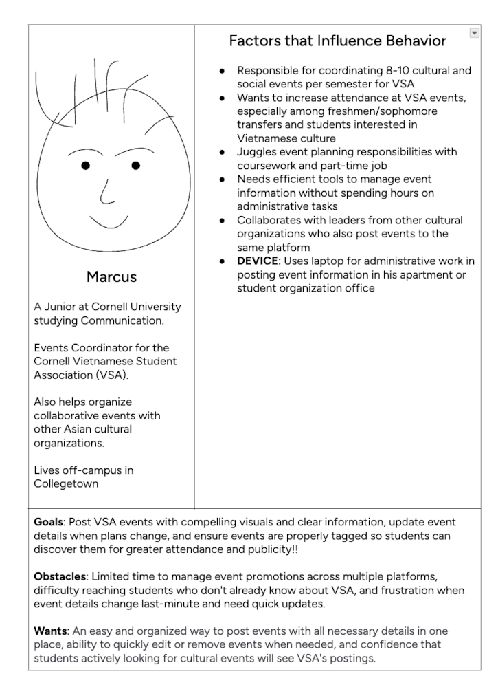

### Administrator: Narrow or Wide Screen
> How will your **administrator** user access this website? From a narrow or wide screen?

Wide screen because Marcus would want to manage event postings from his laptop when he has dedicated time for admin work in his apartment or student organization office. Posting events requires uploading images, writing descriptions and more whihc is easier to do on a larger screen.

## Catalog Design
> Sketch each page of your entire media catalog website
> Provide a brief explanation _underneath_ each sketch. (1 sentence per sketch)
> **Refer to consumer or administrator persona by name in each explanation.**

Consumer's View All
>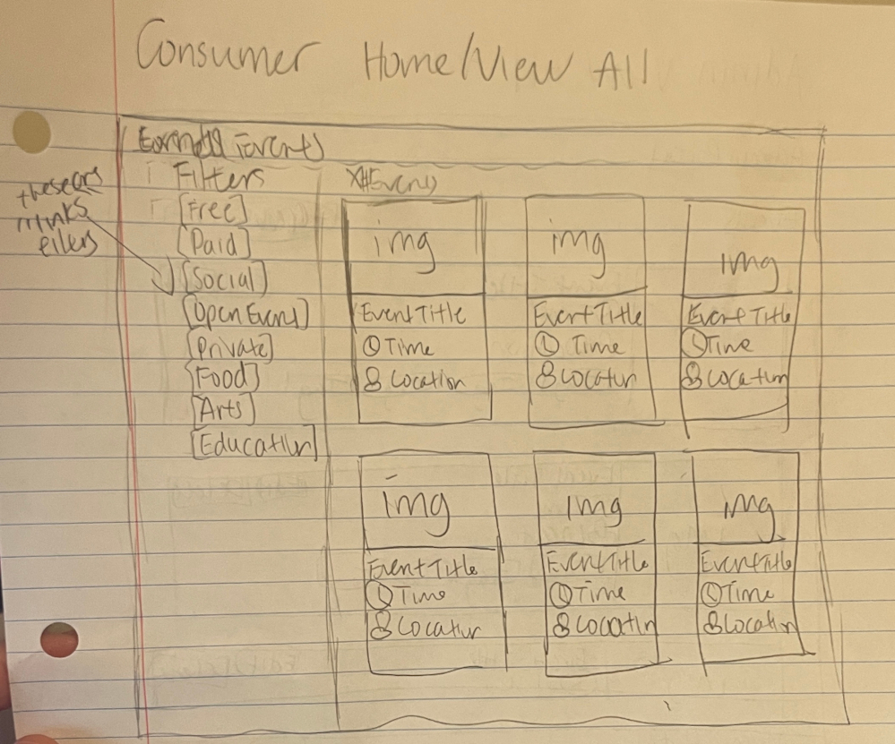
Emma can easily browse all upcoming campus events in a card grid layout on the right side, while suing filter link tags in the left side to view events (free, social, open event, etc.), helping her discover events that best match her interests and budget.

Consumer's Event Details
>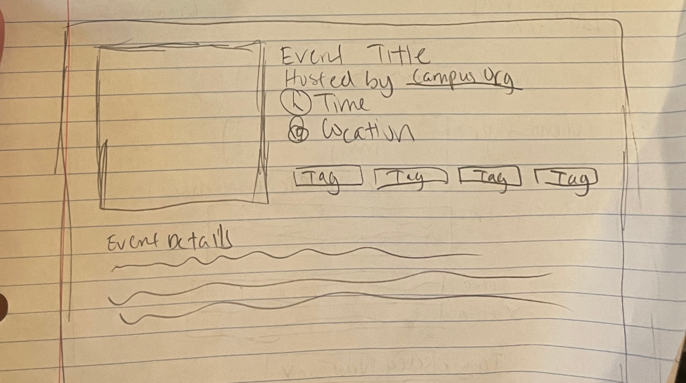
When Emma clicks on an event card, this will take her to a details page with the event image on the left and key information (title, host, time, location, tags) on the right, with the full event descirption below, giving her complete insights to decide whether or not she should attend!

Admin's View All
>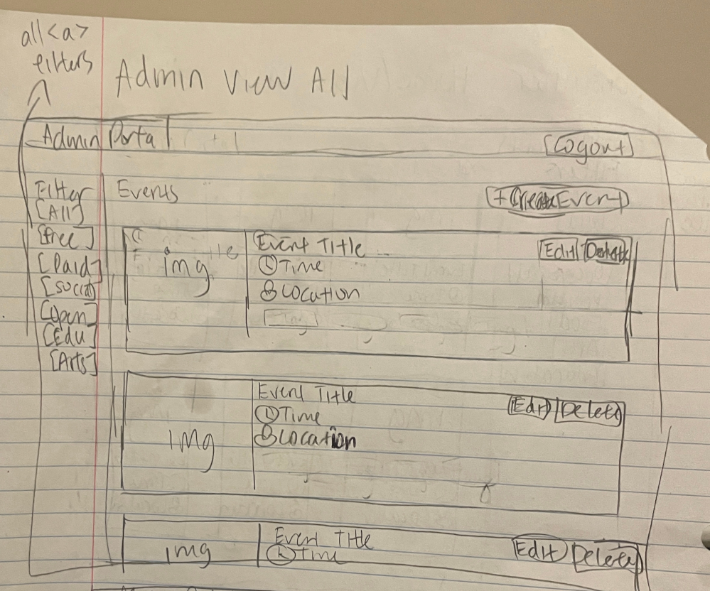
Marcus can see all of the events in a tile layout with thumbnails on the left with filters, event details in the middle, and Edit/Delete buttons on the right, without a logout button in the top right corner, with a Create Event button, allowing him to quikcly manage VSA events.

Admin's Edit Event
>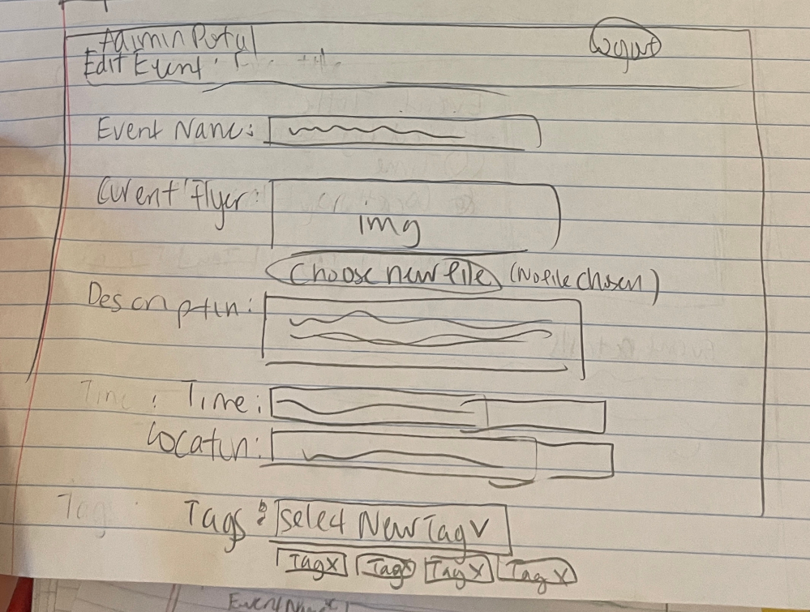
Marcus can quickly edit event details including event name, flyer image, descirption, time, location, and add (dropdown menu)/remove tags (clicking X button), ensuring that VSA event details stay accurate when plans change.

Admin's Add Event
>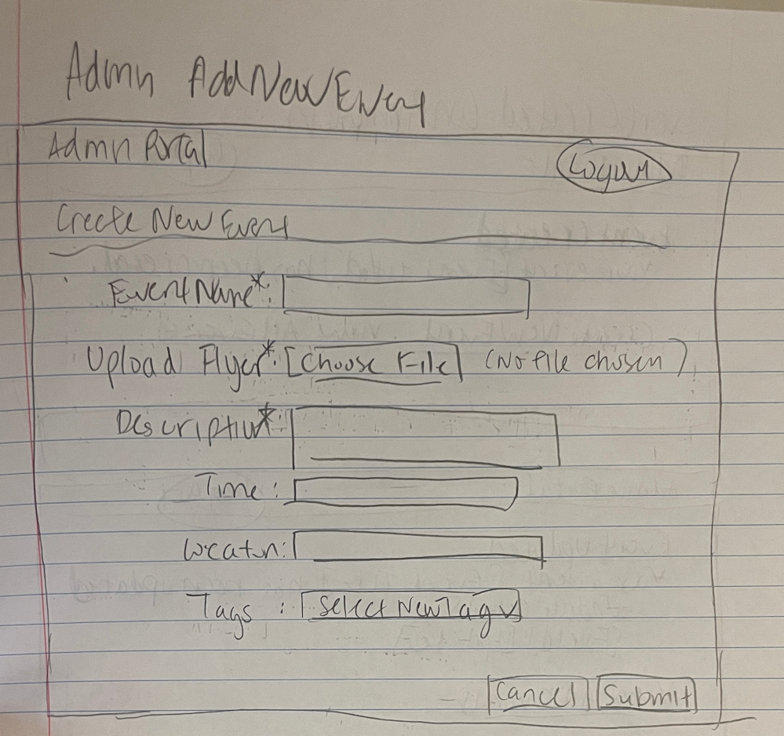
Marcus can create new VSA events by filling out a form with event name, event flyer, descirption, time, location, and tags, making it easy to promote upcoming activities to the campus community.

Admin's LogIn
>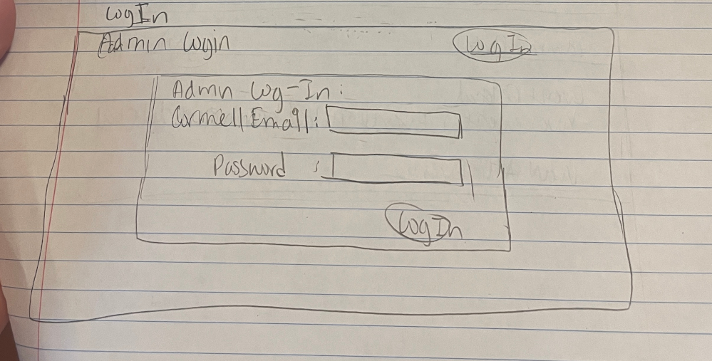
Marcus can easily enter his Cornell email and password to gain access to admin features, ensuring that only authroized student organization leaders can post, edit, or delete events.

Admin's Event Created Confirmation
>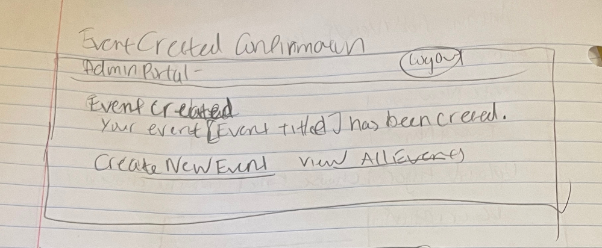
After Marcus submits the create event form, he sees a confirmation message that his event was sucessfully created, providing clear feedback before he can either create more events or view all events.

Admin's Event Deleted Confirmation
>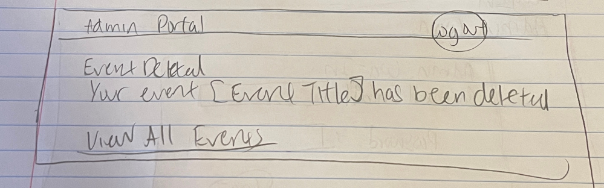
After Marcus saves deletes an event, he sees a confirmation message that the event was sucessfuly removed from the catalog, and also gets clear feedback that the delete was sucessful.

Admin's Event Updated Confirmation
>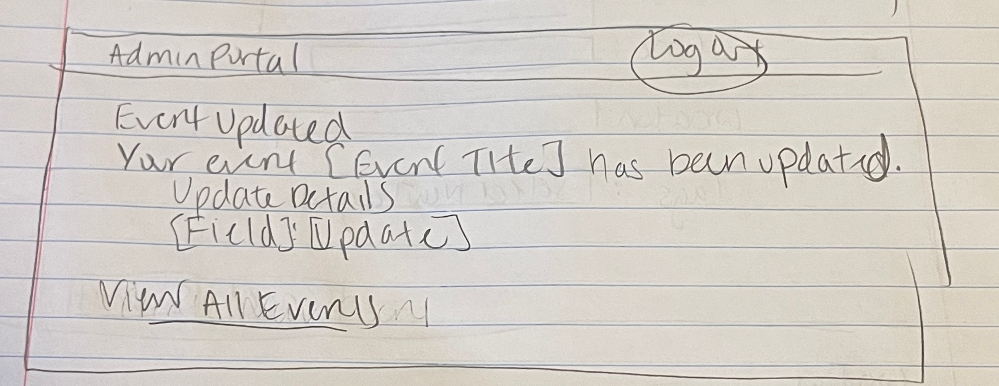
After Marcus saves changes to an event, he sees a confirmation message that the event was sucessfully updated, ensuring that he knows his changes were saved before returning to manage other events.

## Catalog Design Patterns
> Explain how your design employs common catalog design patterns.
For the consumer side, I used a card grid pattern with a left sidebar of clickable tag filter links for browsing all events, and clicking a card takes users to a separate details page with the event image, key information, and full description. For the admin side, I used a tile layout with thumbnails and inline action buttons (Edit/Delete) for each event, following common admin dashboard patterns that provide quick access to management tools (add/edit events) while keeping the full catalog visible.

## URL Design
> Plan your HTTP routing.
> List each route and the PHP file for each route.

| Page                                         | Route                      | PHP File       |
| ----------------------------------------     | -----------                | -------------- |
| home / consumer view all / filter by tag     | /                          | pages/home.php |
| consumer entry details                       | /event                     | pages/event.php|
| admin view all                               | /admin                     | pages/admin.php|
| admin insert entry                           | /admin/create              | pages/create.php|
| admin insert entry confirmation              | /admin/create/confirmation | pages/create-confirmation.php|
| admin edit entry / tag / untag               | /admin/edit                | pages/edit.php |
| admin edit entry / tag / untag confirmation  | /admin/edit/confirmation   | pages/edit-confirmation.php |
| admin delete entry                           | /admin/delete-confirmation | pages/delete-confirmation.php|
| login                                        | /admin/login               | pages/login.php |

> Explain why these routes (URLs) are usable for your persona. (1 sentence)

Emma can easily discover and browse events using the root URL and when viewing event details, /event is very intuitive, while Marcus will easily understand how organized these /admin routes since they logically group all admin functions (as well as confirmation pages) under /admin for creating, editing, and deleting events and login!

## Database Schema
> Plan the structure of your database. You may use words or a picture.
> A bulleted list is probably the simplest way to do this.
> Include constraints for each field.

**Table: events**

- id: INTEGER {PRIMARY KEY, AUTOINCREMENT, NOT NULL, UNIQUE}
- title: TEXT {NOT NULL}
- description: TEXT {NOT NULL}
- time: TEXT {NOT NULL}
- location: TEXT {NOT NULL}
- host_organization: TEXT {NOT NULL}
- image_file: TEXT {NOT NULL}
- image_citation: TEXT {}

**Table: tags**

- id: INTEGER {PRIMARY KEY, AUTOINCREMENT, NOT NULL, UNIQUE}
- name: TEXT {NOT NULL, UNIQUE}

**Table: event_tags**

- id: INTEGER {PRIMARY KEY, AUTOINCREMENT, NOT NULL, UNIQUE}
- event_id: INTEGER {NOT NULL, FOREIGN KEY -> events.id}
- tag_id: INTEGER {NOT NULL, FOREIGN KEY -> tags.id}

## References

### Collaborators
> List any persons you collaborated with on this project.

N/A

### Reference Resources
> Did you use any resources not provided by this class to help you complete this assignment? (Do not list the course resources or the Mozilla documentation.)
> List any external resources you referenced in the creation of your project. (i.e. ChatGPT, etc.)
>
> Provide the URL to the resources you used and include a short description of how you used each resource.

- Seed data generated from ChatGPT (cited externally as well)
[← Table of Contents](design-journey.md)
